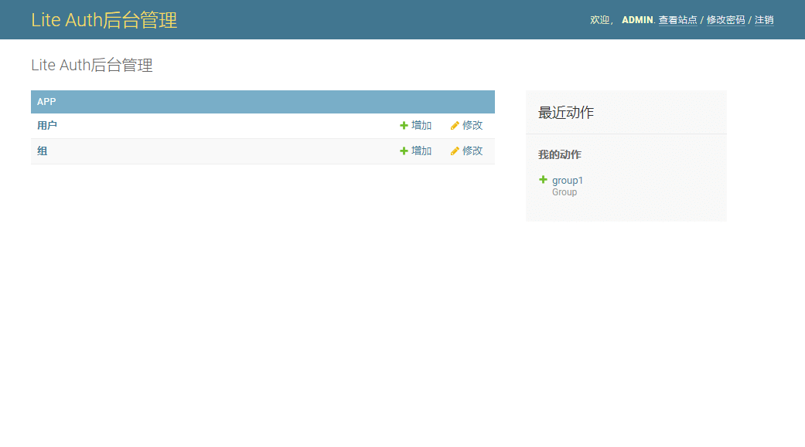
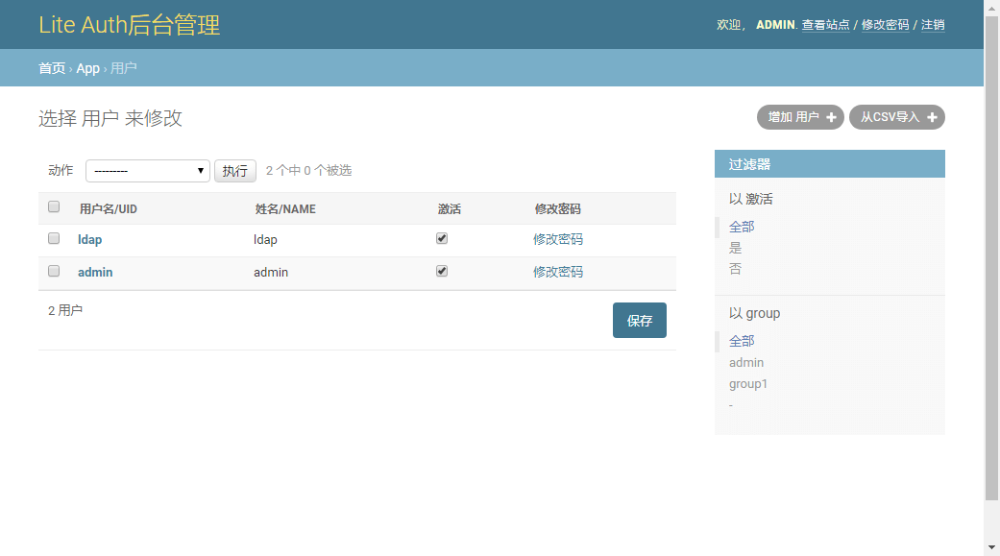
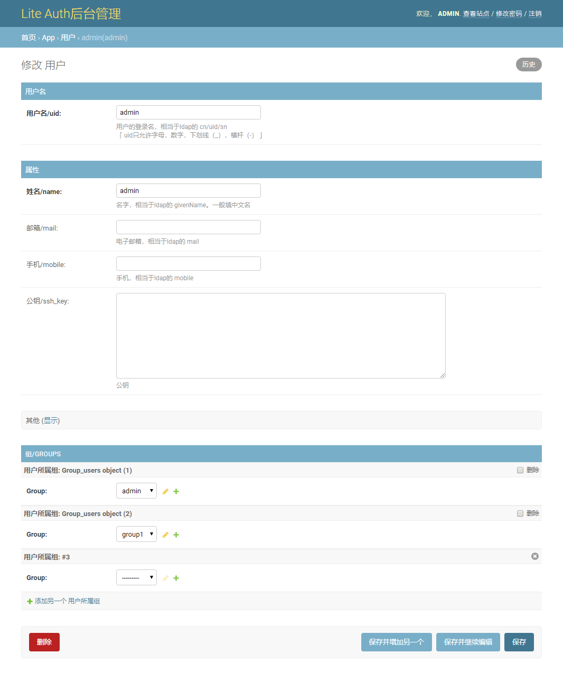

.. LiteAuth documentation master file, created by
   sphinx-quickstart on Wed Sep 23 15:55:04 2020.
   You can adapt this file completely to your liking, but it should at least
   contain the root `toctree` directive.

Welcome to LiteAuth
====================================

LiteAuth是一个基于LDAP精简的身份认证系统。
它针对用户管理，身份认证场景进行了优化，让你能更方便的接入LDAP，管理用户。

特性
====

-  精简了大部分LDAP的内容，无需学习复杂的LDAP体系，直接使用。
-  自带管理后台，添加修改用户更方便。
-  自带安全策略（多次登录失败锁定策略，密码过期策略，密码复杂度校验策略）
-  成员可自主登录管理后台修改密码

链接
====

-  github: https://github.com/gojuukaze/liteAuth
-  文档: https://doc.ikaze.cn/liteauth
-  :ref:`接入liteAuth配置示例<app>`

运行截图
=========
|demo1|

|demo2|

|demo3|

--------------

开源不易，如果你觉得对你有帮助，求打赏个一块两块的

|image1|

.. _LICENSE-EMBEDDING: https://github.com/gojuukaze/liteAuth/blob/master/LICENSE-EMBEDDING
.. _LICENSE: https://github.com/gojuukaze/liteAuth/blob/master/LICENSE

.. toctree::
   :maxdepth: 2
   :caption: 目录

   installation/index
   backup_and_restore
   upgrade
   config
   develop
   ldap/index
   faq

