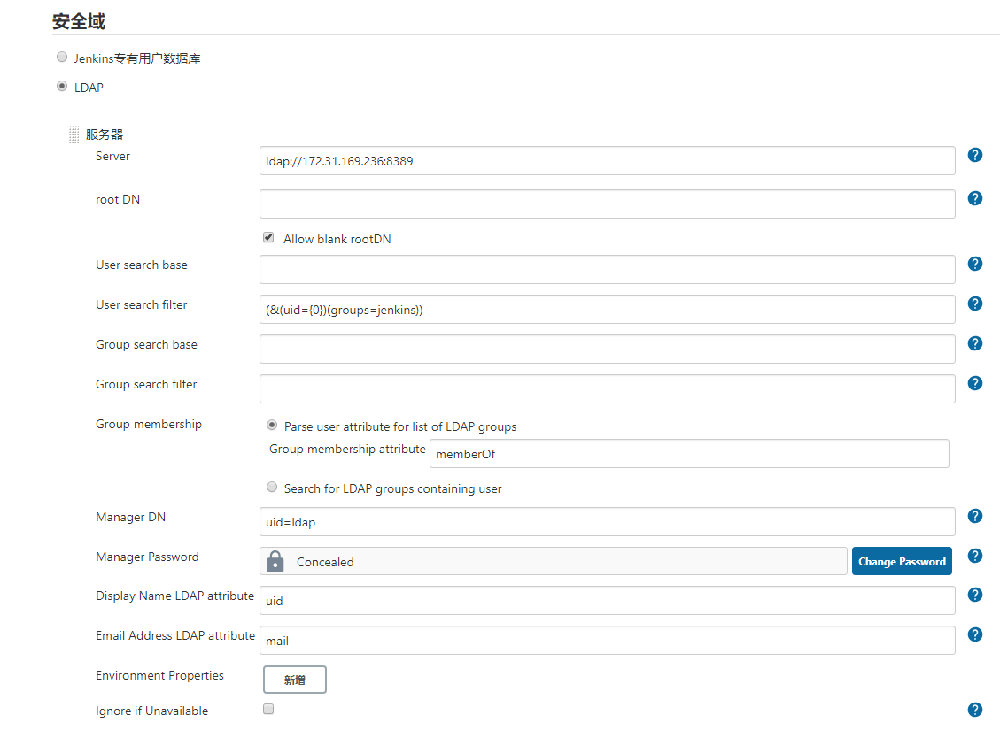
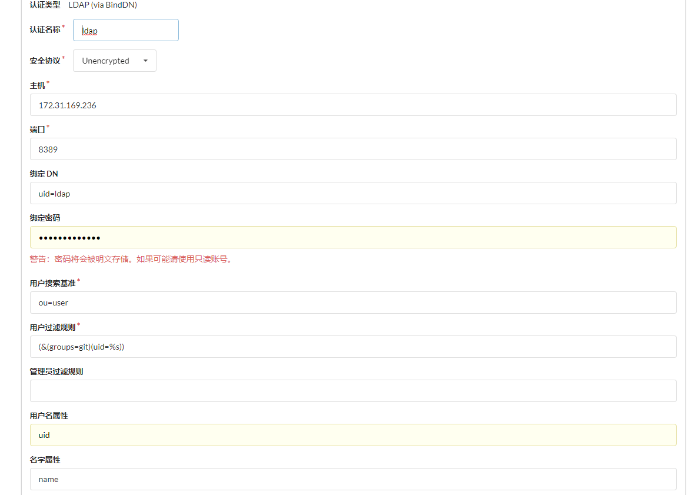

.. _app:

************************
应用接入liteAuth配置示例
************************

应用接入LDAP是一般会有下列几个配置项

* bindDN/managerDN：登录ldap的账号，这里使用只读用户，即"uid=ldap"
* bindPassword ：用户密码
* searchDN/SearchBase/baseDN ：ldap search的baseDN。liteAuth不需要填。如果是必须项可以随意写一个，如："ou=user"
* filter ：用户搜索条件，如：``(&(groups=git)(uid=%s))`` 。

  * groups ：用户所属组
  * uid=%s ：固定格式，登录时会把%s替换为用户名（不同的应用占位符可能不同，比如jenkins中是uid={0}）

jenkins
===============

gitea
================

wekan
=====================

配置下列参数

.. code-block::

    LDAP_ENABLE=true
    DEFAULT_AUTHENTICATION_METHOD=ldap
    LDAP_PORT=8389
    LDAP_HOST=192.168.x.x
    LDAP_BASEDN=dc=liteauth
    LDAP_AUTHENTIFICATION=true
    LDAP_AUTHENTIFICATION_USERDN=uid=ldap
    LDAP_AUTHENTIFICATION_PASSWORD=xxx
    LDAP_REJECT_UNAUTHORIZED=true
    LDAP_USER_SEARCH_FILTER=(&(groups=wekan))
    LDAP_USER_SEARCH_FIELD=uid
    LDAP_USERNAME_FIELD=uid

yapi
==========

在config.json中添加：

.. code-block:: json

    {
        "ldapLogin": {
            "enable": true,
            "server": "ldap://192.168.x.x:8389",
            "baseDn": "uid=ldap",
            "bindPassword": "xx",
            "searchDn": "",
            "searchStandard": "&(groups=yapi)(uid=%s)",
            "emailPostfix": "@xx.com",
            "emailKey": "mail",
            "usernameKey": "uid"
        }
    }