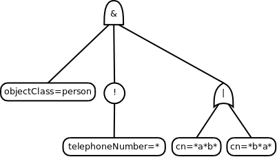

********************
LDAP基本概念
********************

如果你第一次使用LDAP，可以阅读本篇了解下LDAP的基本概念。

DN
==========

DN是一个ldap对象的唯一标识（对象不一定是用户），由一串"key-value"字符串组成。如： ``uid=admin,ou=user,ac=abc,dc=com`` 。

在LDAP中协议中采用树状结构存储数据，上面例子中DN的每一个"key-value"也是一个单独的ldap对象。如

.. code-block::

                  dc=com           -- dn: "dc=com"
                  /     \
               dc=abc   ...        -- dn: "dc=abc,dc=com"
                /
             ou=user               -- dn: "ou=user,dc=abc,dc=com"
            /   |   \
    uid=admin  ...  ...           -- dn: "uid=admin,dc=abc,dc=com"

.. note::

   liteAuth没有使用树状结构，同时移除了"dc","ou"等概念，因此你只能搜到用户

用户的属性
==============

用户处理DN作为唯一标识外还有属性字段，在LDAP中一个用户是这样表示的：

.. code-block::

   dn: uid=admin
   name: admin
   mobile: 130xxx
   mail: a@a.com
   mail: a@a.com

.. note::

   ldap是允许多个同样的属性的，liteAuth暂不支持

搜索与filter的语法
==================

一个ldap的搜索请求有下列几个主要参数：

* baseDN ：在哪个dn下搜索，比如 "dc=abc,dc=com" ，则搜索 "dc=abc,dc=com"下的子节点）
* scope ：搜索范围 (base, one level, subtree)
* filter ：过滤条件，相当于sql的where语句
* attributes ：返回的字段

.. note::

   因为liteAuth没有使用树状结构存储，因此 **搜索用户** 时，"baseDN" , "scope" 是无用的。

filter语法
---------------

filter使用 ``&`` (and) , ``|`` (or) , ``!`` (not) 作为逻辑运算符，使用 ``()`` 分割搜索条件，如：

* ``(name=admin)`` 相当于 ``where name='admin'``
* ``(&(uid=admin)(name=admin))`` 相当于 ``where uid='admin' and name='admin'``
* ``(|(group=admin)(name=a*))`` 相当于 ``where group='admin' or name like 'a%'``

一个根本复杂的例子： ``(&(objectClass=person)(!(telephoneNumber=*))(|(cn=*a*b*)(cn=*b*a*)))``

把它用图表示会更加清晰

